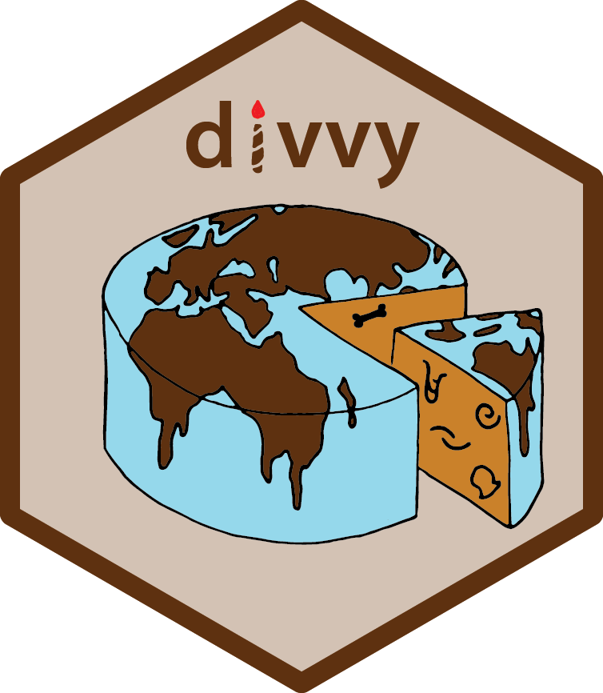
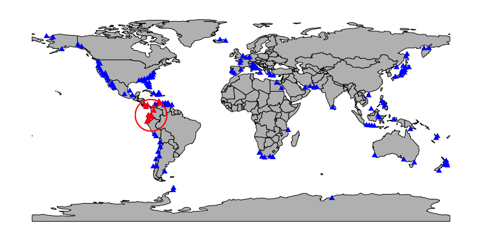

<!-- README.md is generated from README.Rmd. Please edit that file -->

# divvy

<!-- badges: start -->

[](https://github.com/GawainAntell/divvy/actions/workflows/R-CMD-check.yaml)
[](https://github.com/GawainAntell/divvy/actions/workflows/test-coverage.yaml)
[](https://app.codecov.io/gh/GawainAntell/divvy)
<!-- badges: end -->



Divvy up diversity into geographic regions of fair comparison!

## Overview

An R package offering spatial subsampling functions for biogeography and
biodiversity studies, whether analysing fossil or modern taxon
occurrence data, as described by Antell et al. (2023), ‘Spatial
standardization of taxon occurrence data—a call to action’. A preprint
of the *Paleobiology* paper is available at [Earth
ArXiv](https://doi.org/10.31223/X5997Z).

Three types of subsampling are available to to standardise the number
and maximum spread (dispersion) of sites within a region of specified
size:

- `cookies`: Imposes a radial constraint on the spatial bounds of a
  subsample and standardises area by rarefying the number of localities

- `clustr`: Aggregates sites that are nearest neighbours (connecting
  them with a minimum spanning tree) to impose a maximum diameter on the
  spatial bounds of a subsample, and optionally rarefies localities

- `bandit`: Rarefies the number of localities within bands of equal
  latitude

Additional functions include `uniqify` to subset an occurrence dataset
to unique taxon-coordinate combinations, `sdSumry` to calculate basic
spatial coverage and diversity metadata for a dataset or its subsamples,
`rangeSize` to calculate five measures of geographic range size, and
`classRast` to generate a raster containing the most common environment
or trait for point occurrences falling in each grid cell.

There are vignettes accompanying the package, to demonstrate use cases
of `divvy` functions and describe common considerations for analyses of
taxonomic occurrence data. You can view the compiled documents at the
[package website](https://gawainantell.github.io/divvy/) under [‘Getting
started’](https://gawainantell.github.io/divvy/articles/).

## Installation

You can install the newest release of `divvy` from CRAN:

``` r
install.packages('divvy')
```

Alternatively, you can install the development version of `divvy` from
[GitHub](https://github.com/) with help from `devtools`:

``` r
# install.packages('devtools')
devtools::install_github('GawainAntell/divvy')
```

## Usage examples

### `bivalves`: Package data

(Palaeo)ecologists often want to inspect basic information about taxon
occurrence datasets such as number of occurrences, number of unique
localities, general size and position of the study region, and
biodiversity. This may be an initial step to become acquainted with the
data, or it may be a final step of analysis to estimate ecological
variables of interest. Let’s load one of the example datasets in with
`divvy` to demonstrate some functions that may help analyse it. The
occurrences are latitude-longitude point coordinates of Pliocene
bivalves from the Paleobiology Database; before proceeding further,
let’s rasterise these into an equal-area grid, a common starting point
for biogeography analysis.

``` r
library(divvy)
data('bivalves')

# initialise Equal Earth projected coordinates
library(terra)
rWorld <- rast()
prj <- 'EPSG:8857'
rPrj <- project(rWorld, prj, res = 200000) # 200,000m is approximately 2 degrees
values(rPrj) <- 1:ncell(rPrj)

# coordinate column names for the current and target coordinate reference system
xyCartes <- c('paleolng','paleolat')
xyCell   <- c('cellX','cellY')

# extract cell number and centroid coordinates associated with each occurrence
llOccs <- vect(bivalves, geom = xyCartes, crs = 'epsg:4326')
prjOccs <- project(llOccs, prj)
bivalves$cell <- cells(rPrj, prjOccs)[,'cell']
bivalves[, xyCell] <- xyFromCell(rPrj, bivalves$cell)
```

### `uniqify`: Subset to unique occurrences

Now let’s examine the data with some `divvy` functions. First, we can
apply `uniqify` to leave out any duplicate occurrences of a taxon within
a grid cell. This shortens the dataset (and thereby reduces memory use)
by more than half.

``` r
nrow(bivalves)
#> [1] 8095
bivalves <- uniqify(bivalves, taxVar = 'genus', xy = xyCell)
nrow(bivalves)
#> [1] 3061
```

### `sdSumry`: Summary spatial and diversity metrics

How many taxa are there? Over how many sites (equal-area grid cells)?
How many degrees of latitude do those sites span? The `sdSumry` function
returns this and related spatial and diversity metadata.

``` r
sdSumry(bivalves, taxVar = 'genus', xy = xyCell, crs = prj)
#>      nOcc nLoc centroidX centroidY latRange greatCircDist meanPairDist
#> [1,] 3061  157 -434404.9   1647720 137.4159      28917.12     11375.07
#>      minSpanTree     SCOR nTax
#> [1,]    93349.91 20.64401  550
```

There are just over 3000 unique taxon-site occurrences, including 550
genera from 157 grid cells across 137 degrees latitude.

### `rangeSize`: Calculate geographic range size

Maybe we aren’t interested in community ecology and instead care about
the geographic distribution of focal taxa, such as the mussel *Mytilus*
and scallop *Yabepecten*. Provide the coordinates for these two taxa to
`divvy`’s `rangeSize` function:

``` r
myti <- bivalves[bivalves$genus == 'Mytilus',    xyCell]
yabe <- bivalves[bivalves$genus == 'Yabepecten', xyCell]

rangeSize(myti, crs = prj)
#>      nLoc centroidX centroidY latRange greatCircDist meanPairDist minSpanTree
#> [1,]   18  67152.05   4750551 99.31458      22351.73     10390.96    37303.68
rangeSize(yabe, crs = prj)
#>      nLoc centroidX centroidY latRange greatCircDist meanPairDist minSpanTree
#> [1,]    2  11856041   5039440 1.808585           200          200         200
```

*Mytilus* is observed in 18 grid cells spread over tens of thousands of
kilometers. In contrast, *Yabepecten* occurs in only two localities, 200
km apart at their grid cell centroids.

If we back-transform the two locality’s coordinates from Equal Earth
projection to familiar latitude-longitude, we can tell *Yabepecten* has
been reported only in northern Honshu, Japan (140-141 E longitude, 40-42
N latitude).

``` r
yabeVect <- vect(yabe, geom = xyCell, crs = prj)
project(yabeVect, 'epsg:4326')
#>  class       : SpatVector 
#>  geometry    : points 
#>  dimensions  : 2, 0  (geometries, attributes)
#>  extent      : 139.6679, 141.3001, 40.16519, 41.97377  (xmin, xmax, ymin, ymax)
#>  coord. ref. : lon/lat WGS 84 (EPSG:4326)
```

### `cookies`: Subsample global data into equivalent regions

The `bivalves` dataset spans most of the world’s oceans. If we were
interested in a question such as how diversity at this Pliocene time
step compares against diversity from an earlier interval when geographic
sampling coverage was much more limited, we’d have to account for this
different data distribution—otherwise, we’d unfairly estimate the
well-sampled Pliocene to be far more diverse. Geographic standardisation
of both area (acreage or number of sites studied) and dispersion (amount
sites are spread apart) allows fair comparisons of ecological variables
like richness, whether between time steps, environments, or other
comparison groups with heterogeneous spatial coverage.

`divvy` offers three functions for subsampling (`cookies`, `clustr`, and
`bandit`) which differ in how they standardise for dispersion. The
easiest form of subsampling to visualise is applying a circular
constraint to define the bounds of a subsample region. Within that
region, a given number of sites are selected, to standardise area. Here,
let’s take 10 subsamples of the `bivalves` occurrences, each containing
12 sites within a circular region of 1500km (about the size of
Australia.)

``` r
set.seed(1)
circLocs <- cookies(dat = bivalves, xy = xyCell, 
                    iter = 10, nSite = 12, r = 1500, 
                    crs = prj, output = 'full')
```

Below is a map of one possible subsample (red, with regional constraint
drawn around it). Sites not included in the subsample, including one
within the regional constraint, are plotted in blue.



An individual subsample (one `data.frame` element of the returned `list`
object) contains all occurrences from the subsampled sites. Here’s a
peek at the first subsample, to show it’s just a subset of `bivalves`.

``` r
str(circLocs[[1]])
#> 'data.frame':    338 obs. of  12 variables:
#>  $ genus        : chr  "Anomia" "Chlamys" "Mercenaria" "Ostrea" ...
#>  $ paleolng     : num  -80.5 -80.5 -80.5 -80.5 -87.4 ...
#>  $ paleolat     : num  27.5 27.5 27.5 27.5 31 ...
#>  $ collection_no: int  41496 41496 41496 41496 41824 58893 58893 58893 58893 58893 ...
#>  $ reference_no : int  11119 11119 11119 11119 11118 16700 16700 16700 16700 16700 ...
#>  $ environment  : chr  "marine indet." "marine indet." "marine indet." "marine indet." ...
#>  $ max_ma       : num  5.33 5.33 5.33 5.33 5.33 ...
#>  $ min_ma       : num  3.6 3.6 3.6 3.6 3.6 ...
#>  $ accepted_name: chr  "Anomia simplex" "Chlamys" "Mercenaria campechiensis" "Ostrea" ...
#>  $ cell         : num  4178 4178 4178 4178 3832 ...
#>  $ cellX        : num  -7343959 -7343959 -7343959 -7343959 -7743959 ...
#>  $ cellY        : num  3539440 3539440 3539440 3539440 3939440 ...
```

Because each subsample has the same information structure as the
original dataset, we can analogously calculate summary spatial and
diversity data for them using `sdSumry`. Each row of the returned matrix
corresponds to one of the ten subsamples. In this small group of
replicate subsamples, regional richness ranges from 117 to 194 genera.
The number of localities is always 12, as was specified above, and the
dispersion of subsamples is always within the upper bound set by the
diameter of 3,000km (e.g. maximum great circle distance across any
subsample’s sites is 2807km).

``` r
sdSumry(circLocs, taxVar = 'genus', xy = xyCell, crs = prj)
#>    nOcc nLoc   centroidX centroidY latRange greatCircDist meanPairDist
#> 1   338   12  -6977292.4   4156106 10.25901      1612.452     781.6607
#> 2   265   12 -10160625.7   4072773 17.14477      2039.608     910.6453
#> 3   410   12  -6727292.4   2356106 17.67042      2720.294    1289.9956
#> 4   252   12 -10127292.4   3889440 18.77490      2209.072     888.0877
#> 5   460   12  -6993959.1   4056106 11.91278      1720.465     757.5157
#> 6   446   12    406040.9   5589440 11.37344      1562.050     833.9107
#> 7   293   12 -10177292.4   4239440 20.61302      2408.319     866.7620
#> 8   224   12 -10127292.4   5239440 27.00700      2807.134    1119.3347
#> 9   446   12    406040.9   5589440 11.37344      1562.050     833.9107
#> 10  350   12    256040.9   5389440 14.91345      1811.077    1047.1642
#>    minSpanTree     SCOR nTax
#> 1     2814.214 33.87300  141
#> 2     2800.000 26.46397  121
#> 3     4097.770 40.52424  194
#> 4     2847.214 25.14927  117
#> 5     2731.371 48.65573  166
#> 6     3402.094 44.22359  190
#> 7     2965.685 29.02605  130
#> 8     3665.081 21.11620  121
#> 9     3402.094 44.22359  190
#> 10    4287.575 33.92261  163
```
